# Basic workflow

1. Pick a task from Kanban

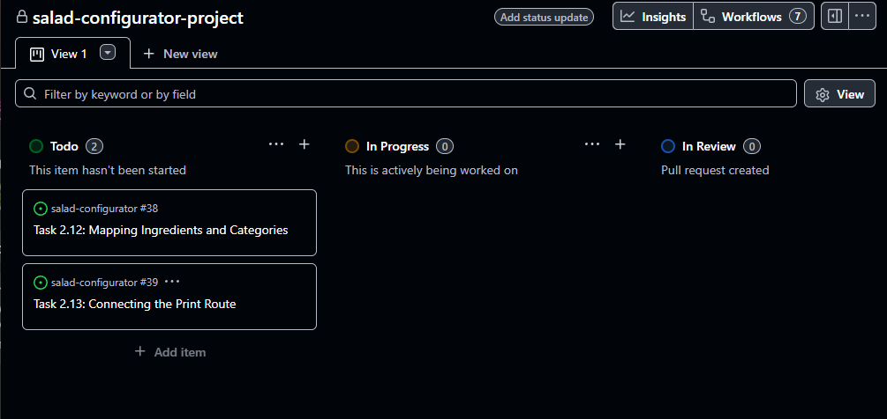

2. Assign the task to yourself from the right panel in task view.

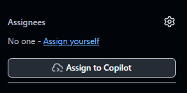

3. Create a branch from the right panel in task view. (with CLI or Github)

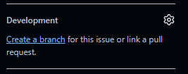

4. Choose "Checkout locally" -> "Create Branch"

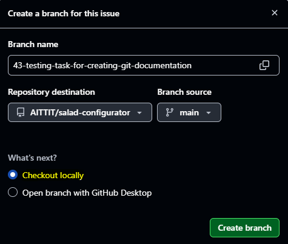

5. Run the given commands in your working directory with CLI

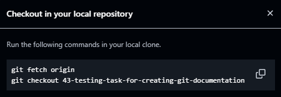

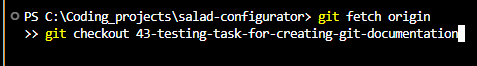

6. Move task in Kanban

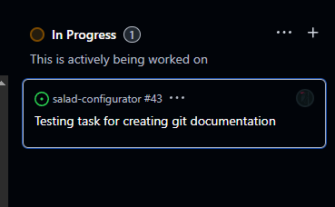

7. Do the work, add, commit and push (might get some errors about the branch head not pointing to the right remote branch.)

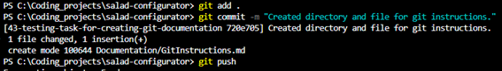

8. Create a pull request on the "Pull requests" tab in Github, click "New pull request"

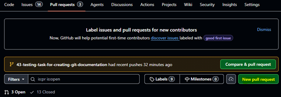

9. Choose the right branch to merge:

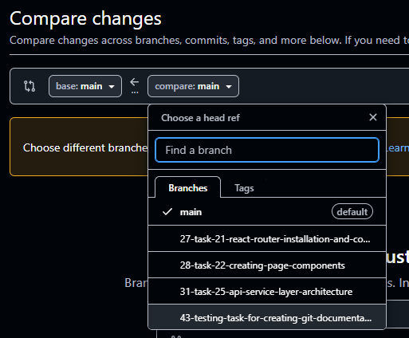

10. Create pull request:

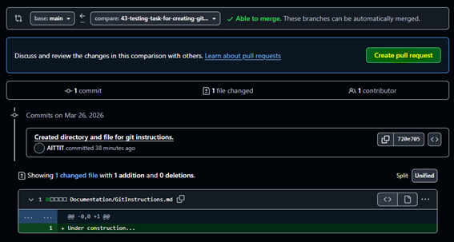

11. Details can be written in the description section.

(Might be redundant because GitHub seems to move the tasks already when the branch of the same issue is merged, but Writing "Closes [task_number]" moves the task to Done in the kanban board after merging.)

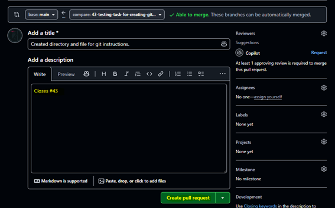

12. Now the PR needs to be reviewed for it to be able to merge into main

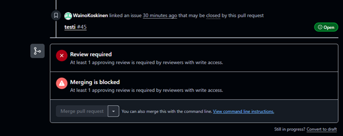