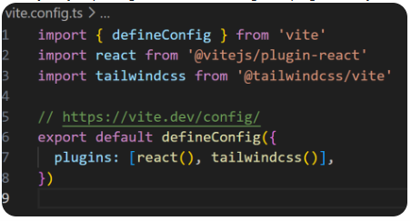

# Creating a vite React + TS + tailwind project

This command creates a project directory in the root where the command is run:

`npm create vite@latest [proj_name] -- --template react-ts`

### Setting up tailwind:

`cd [proj_name]`

`npm install tailwindcss @tailwindcss/vite`

Feel free to empty the assets folder.

In 'vite.config.ts' file:

Add the tailwindcss() inside plugins.

Clean the index.css and just import tailwind there

`@import "tailwindcss";`

Delete App.css

## Installing different packages

While in the project folder,

### install react router:

`npm install react-router dom`

### install Zustand:

`npm install zustand`

If the project was pulled from a remote git repo, the command

`npm install`

in the project folder should be enough.
