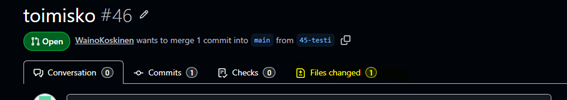
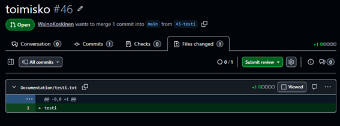
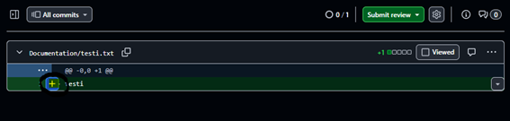
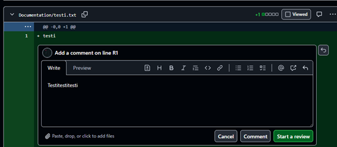
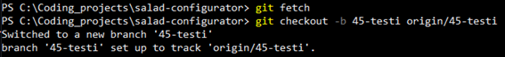
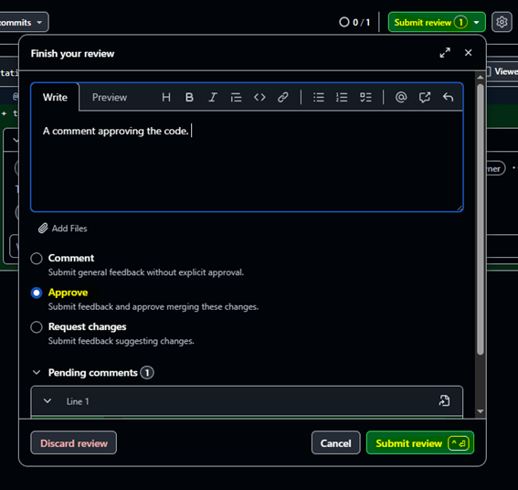

# The Review Process

The goal of the review is not for the reviewer to make changes to actual branch. If something is bugged or other issues are found,  the reviewer only makes notes, they can make suggestions about how to fix them in the review in Github, and the author is responsible for making the required changes. So when pulling someone else’s branch, one should never need to push any changes to someone else’s feature branch. So the purpose of pulling the feature branch is to run the code, possibly make edits and tests, but almost never push your changes to someone else's pull request. The comments are made in the review. 

I am not so sure anymore about how strictly we will be able to follow this.

## Review Steps

1. Go into the Files changed tab in the pull request to see changes to the code:

The code review view:

To add comments:

Not every change needs to be tested locally, but in some cases it is a good idea to actually run the code, especially because we don't have any automatic tests.

2. Making a local branch from a remote:

3. Approving the code and submitting the review:

[I have not tried what exactly happens if "Request changes" is chosen.
To be continued...]

## When the PR has gone through

Deleting a feature branch locally:

If Git complains it's unmerged use `-D`

Clean up remote-tracking branches:

## ChatGPT's thoughts on the review process for student teams

“In small student teams, it’s totally fine to pull the branch locally to see UI changes or run code, but you don’t have to do it for every PR.”

- For backend logic / small fixes -> rely on code review + manual inspection
- For frontend/UI changes -> reviewers may pull branch locally to test
- For learning purposes -> it's good for everyone to pull branches locally occasionally, so you all understand each other's code